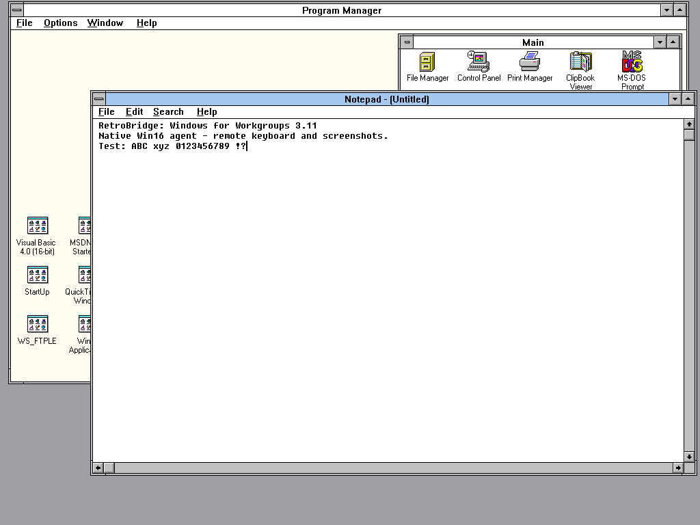
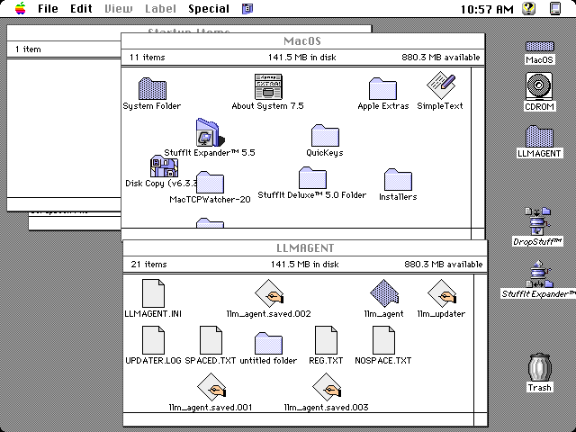

# RetroBridge

**Remote control and automation for vintage computers.**

Native agents and an MCP bridge give modern tools and LLM clients hands-on access to legacy
machines — Windows for Workgroups 3.11, Windows 95/98/ME/NT4/2000/XP/7,
FreeDOS, OS/2, NetWare, and classic Mac OS (System 7) — on an isolated lab network: run shell commands,
transfer files, take screenshots, send mouse/keyboard input.
Built after `freeSSHd` turned out to break other software (couldn't install
MSSQL alongside it) — see [docs/ARCHITECTURE.md](docs/ARCHITECTURE.md) for
why this isn't "just use a different SSH server."

Agents disconnect stalled clients after 10 seconds for authentication,
60 seconds for a command line, or 30 seconds without transfer progress.
These are network deadlines, not command runtime limits. See
[agent network deadlines](docs/NETWORK_TIMEOUTS.md).

Platform support varies: classic Mac OS has no shell, DOS/NetWare expose
text screenshots, and several desktop tools are platform-specific. See the
[MCP coverage](docs/MCP_COVERAGE.md) and [publication audit](docs/PUBLICATION_AUDIT.md) for
the current limits, verified coverage, and outstanding issues.
The [documentation guide](docs/README.md) links all platform and maintainer guides.
To compile every agent and its helpers onto one mountable CD image, see
[building the deployment ISO](docs/BUILD_ISO.md).

## Screenshots

[View the agent-captured gallery](docs/SCREENSHOTS.md): 13 running OS/version
combinations, including FreeDOS, Windows, OS/2, System 7 and NetWare.

| Windows for Workgroups 3.11 | Mac OS System 7.5.3 |
| --- | --- |
|  |  |

## License and build dependencies

Original project code and documentation are [MIT licensed](LICENSE).
Third-party SDKs, libraries, and guest software retain their own terms; see
[licensing, provenance, and dependency setup](THIRD_PARTY.md). Apple and
Novell SDK inputs are supplied locally and verified against a file manifest.
They are not included in this repository or downloaded by the setup tool.
This is a **source release**. Compiled releases still
have the per-platform requirements in [the binary release review](docs/BINARY_RELEASE.md).

Previously developed as `retro-ssh-server`. Existing `llm_agent` binaries,
`legacy_*` tool names, and `LEGACY_MACHINES_FILE` settings remain compatible.
You can keep an existing `~/.retro-ssh-server/machines.ini`; the new name does
not require moving or regenerating your private inventory.

## Nomenclature

This repo has three distinct layers:

- **Target agents** — the small `llm_agent` binaries that run on the legacy
  machines. These speak this repo's private TCP wire protocol.
- **MCP bridge / MCP server** — `mcp-server/server.py`, which runs on the modern
  control machine and translates MCP tool calls into target-agent protocol
  commands.
- **MCP tools** — the individual `legacy_*` functions exposed by the bridge,
  such as `legacy_exec`, `legacy_screenshot`, and `legacy_upload`.

So the short version is: **run a target agent on each legacy machine; run the
MCP bridge on the modern host; call the `legacy_*` MCP tools from your LLM
client.**

Pieces:

- **`agent-win32/`** — the Win32 target agent: `llm_agent`, a single small C
  service you cross-compile and copy onto the legacy Windows machine. One
  token-authed TCP channel
  does everything: runs commands, moves files, captures the screen, sends
  mouse/keyboard input. No separate remote-desktop package is required on the
  guest — screenshots/input are built straight into the agent with GDI and
  `mouse_event`/`keybd_event`, not a separately-installed VNC server. See
  [docs/ARCHITECTURE.md](docs/ARCHITECTURE.md#win32-desktop-capture-and-input)
  for capture and desktop-session details.
- **`agent-dos/`** — FreeDOS target-agent port of the same wire protocol
  (Open Watcom + Watt-32). Supports exec/file transfer/sysinfo/reboot plus text-mode
  screenshot and BIOS keyboard inject. See [agent-dos/README.md](agent-dos/README.md).
- **`agent-os2/`** — OS/2 2.x target-agent port (Open Watcom 32-bit LX +
  SO32DLL + PM). Supports exec/file/sysinfo plus full desktop `SCREENSHOT`.
  See [agent-os2/README.md](agent-os2/README.md).
- **`agent-os2-13/`** — OS/2 1.3 target-agent port, a separate 16-bit NE
  build because OS/2 1.x predates the 32-bit kernel. See
  [agent-os2-13/README.md](agent-os2-13/README.md).
- **`agent-win16/`** — Windows for Workgroups 3.11 target-agent port
  (Win16 + Winsock 1.1). See [agent-win16/README.md](agent-win16/README.md).
- **`agent-netware/`** — NetWare 3.12+ NLM target-agent port (Open Watcom +
  CLIB BSD sockets). See [agent-netware/README.md](agent-netware/README.md).
- **`agent-mac-system7/`** — classic 68k Mac OS target agent (Retro68 +
  MacTCP). Supports data-fork file transfer, screenshots, processes, and
  limited input automation; no shell, cross-application clipboard, or
  window enumeration. See [agent-mac-system7/README.md](agent-mac-system7/README.md).
- **`mcp-server/`** — the MCP bridge/server you run on your modern control
  machine, exposing target-agent commands as MCP tools.

If you also want to *watch* the box yourself, live, independent of the
LLM tooling — RDP or your hypervisor's console both work fine and don't
need anything from this repo. See the RDP-vs-console-session caveat in
ARCHITECTURE.md if you use RDP for that, though: it can end up looking at
a different session than what `legacy_screenshot` sees.

**Trust model**: no transport encryption, just a shared token per
machine. Only put this on an isolated host-only/lab network — see
[docs/ARCHITECTURE.md#trust-model](docs/ARCHITECTURE.md#trust-model).

## 1. Build a target agent (Win32 walkthrough)

The following build/deploy steps cover Win32. Use the platform README links
above for DOS, Win16, OS/2, NetWare and Mac. The Win32 build requires MSYS2
`mingw-w64-i686` with the legacy MSVCRT runtime:

```bash
pacman -S --needed mingw-w64-i686-gcc mingw-w64-i686-binutils
```

```bash
cd agent-win32
PATH="/c/msys64/mingw32/bin:$PATH" make
```

(`make` invokes `i686-w64-mingw32-gcc`, which itself shells out to
`cc1.exe`; that binary's runtime DLLs live in `mingw32/bin`, so that
directory has to be on `PATH` for the *whole* build, not just for finding
`gcc` itself — a silent, no-error-message failure otherwise.)

This produces `agent-win32/llm_agent.exe` and `agent-win32/update.exe` (see
[docs/ARCHITECTURE.md](docs/ARCHITECTURE.md#self-update) — used for
in-place updates, not part of normal deployment), both 32-bit PE binaries
stamped for Windows 4.0 (95/NT4-era). The stamp alone does not establish
compatibility: guest DLLs and CPU instructions must also match. Win95 needs
Winsock 2; the current prebuilt CRT retains some CMOV instructions, so real
486/non-Pro Pentium compatibility is not certified. See the audit for tested
guests and limits. Sanity-check with `file llm_agent.exe` — should
read `PE32 executable for MS Windows 4.00 (console)`.

## 2. Deploy to each legacy machine

Repeat the appropriate platform installation for each guest. Each needs its
own agent and unique random token. Generate one on the control machine, for
example with `python -c "import secrets; print(secrets.token_hex(32))"`, and
put the same value in that guest's configuration and your private inventory.

Copy `llm_agent.exe` and `agent-win32/llm_agent.ini.example` (renamed to
`llm_agent.ini`) to the target machine, in the same directory. Edit
`llm_agent.ini`:

```ini
port=2222
token=REPLACE_WITH_UNIQUE_TOKEN
```

On NT4/2000/XP, install the service and start it:

```
llm_agent.exe --install
net start LLMAgent
```

On NT-family (NT4/2000/XP) `--install` registers a service (`LLMAgent`),
launched with `SERVICE_INTERACTIVE_PROCESS` so it can actually see/drive
the logged-on user's real desktop for screenshot/click/key/type — pre-Vista
Windows has no Session 0 isolation, so this works, but only while someone
is logged in locally on the console (see ARCHITECTURE.md for the details
and the RDP-session caveat). On Windows 9x, `--install` adds a `RunServices`
registry key instead — it'll start at the next boot, or run it immediately
with `llm_agent.exe --run`.

If you already had an older `llm_agent.exe` installed as a service, run
`llm_agent.exe --uninstall` first and reinstall — the interactive-process
flag requires updating the service registration. New protocol commands
come from the replacement binary and do not themselves require reinstalling
the service.

For Windows 7 desktop automation, run the agent in the logged-in user's
session with `llm_agent.exe --run`; services are isolated from that desktop.
The NT update helper still assumes a service installation. Interactive
self-update and next-logon autostart remain follow-ups, not verified guarantees.

## 3. Set up the bridge

Use Python 3.12 (the tested host version). The commands below use a Windows
virtual environment; on Linux/macOS use `.venv/bin/python` and `.venv/bin/pip`.

```bash
cd mcp-server
python -m venv .venv
./.venv/Scripts/pip install -r requirements.txt
```

List every legacy machine in a `machines.ini` — copy `machines.ini.example`
and fill in one `[section]` per machine:

```ini
[win2k-1]
host = 192.168.56.10
exec_port = 2222
exec_token = REPLACE_WITH_UNIQUE_TOKEN
max_command_bytes = 4094
text_encoding = cp1252
exec_encoding = cp437

[winxp-1]
host = 192.168.56.11
exec_token = REPLACE_WITH_UNIQUE_TOKEN
text_encoding = cp1252
exec_encoding = cp437
```

The section name (`win2k-1`, `winxp-1`, ...) is what you pass as the
`machine` argument to every tool below. `exec_port` is optional (defaults
to `2222`).

The shared client rejects CR, LF, and NUL in command arguments and tokens,
and tabs inside registry fields. Limits count bytes in the selected encoding, including
the command name and separators but excluding the final LF:

Text defaults to strict ASCII. Set `text_encoding` for the guest's general
text and `exec_encoding` for captured shell output (the examples above assume
English Windows ANSI 1252/OEM 437). Win16 also needs `file_encoding = cp437`
for DOS filenames on that locale. `exec_command_encoding` can override EXEC
input separately. `legacy_exec` accepts a per-call `output_encoding` override.
Binary transfers remain bytes; TYPE/KEY are ASCII only. See
[text encodings](docs/TEXT_ENCODINGS.md) for configuration and limitations.

| Setting | Default | Use |
|---|---|---|
| `max_command_bytes` | `510` | Safe for the 512-byte agent line buffers. Set `4094` only for a confirmed Win32 agent with a 4096-byte buffer. |
| `max_response_bytes` | `67108864` (64 MiB) | Maximum SIZE payload or cumulative EXEC output. Raise explicitly for larger downloads, up to `2147483647`. |

Both settings are optional per-machine INI keys and keyword arguments to
`AgentClient`. Commands over the configured limit fail before connecting;
they are not truncated or split. Shell and individual command limits may
be smaller, especially COMMAND.COM's command tail on Windows 9x/DOS.
Response lines are capped at 65536 bytes, allowing Win16's full listbox-text
reply. Invalid framing, oversized payloads, or incomplete replies close the connection.
The payload limit does not rewrite or inspect binary file contents.

Updated target agents also enforce the 510/4094-byte line limits directly,
including for raw TCP clients. Lines must end in LF or CRLF; overflow,
embedded NUL, and misplaced CR close the session without executing the
partial line or queued commands. Binary upload contents remain unchanged.
See [agent command framing](docs/COMMAND_FRAMING.md).

Sections default to enabled agents and require `host` and `exec_token`.
To keep an SSH host or other infrastructure in the same inventory, mark
it explicitly as inventory-only; no dummy token or port is needed:

```ini
[ubuntu-host]
host = 192.168.56.40
agent_enabled = false
```

Inventory-only entries still require `host` and appear in
`legacy_list_machines`, but agent tools reject them before connecting.
Their agent credentials, port, and limit settings are ignored. Other metadata may
remain in the file; this bridge does not provide SSH access. A malformed
enabled agent still rejects the inventory, so missing credentials are not
silently treated as disabled agents. Configuration is cached until the
bridge restarts. Use unique ASCII
tokens (up to 127 characters for compatibility with all ports), never the
example token. Examples, smoke scripts, and floppy builders use
`REPLACE_WITH_UNIQUE_TOKEN`; substitute a private per-machine value before
using them, and keep generated configuration/media out of Git. The Mac
agent reads `token=` and optional `port=` (default 2222) from `LLMAGENT.INI`
beside its executable; see [Mac configuration](agent-mac-system7/README.md#installation-and-configuration).

**Put your real `machines.ini` outside the repo**, for example
`~/.retrobridge/machines.ini`, and set `LEGACY_MACHINES_FILE` to its absolute
path. This separates live credentials from example inventories and development
scratch files. Keep a private backup; ignored files cannot be recovered from Git.

Wire the bridge into your MCP client config (e.g. Claude Code) as a stdio
server:

```json
{
  "mcpServers": {
    "RetroBridge": {
      "command": "C:\\path\\to\\RetroBridge\\mcp-server\\.venv\\Scripts\\python.exe",
      "args": ["C:\\path\\to\\RetroBridge\\mcp-server\\server.py"],
      "env": {
        "LEGACY_MACHINES_FILE": "C:\\Users\\you\\.retrobridge\\machines.ini"
      }
    }
  }
}
```

If `LEGACY_MACHINES_FILE` isn't set, it falls back to `machines.ini` next
to `server.py` — fine for quick local testing, just not for the real
config (see above).

Exposed tools, all but `legacy_list_machines` taking a `machine` argument
naming the `machines.ini` section to target (call `legacy_list_machines`
first if you don't remember the exact name):

- `legacy_list_machines`
- `legacy_capabilities` — read `SYSINFO` and return advisory platform tools
  and limitations. This describes current source coverage, not negotiated
  support for every installed build. See [MCP coverage](docs/MCP_COVERAGE.md).
- `legacy_exec`, `legacy_exec_detach`, `legacy_ping` — run a command,
  launch a command without waiting, check connectivity. Use
  `legacy_exec_detach` for GUI apps and long-running helpers on Win32/Win16/OS2.
  Win16's detached reply contains an instance handle, not a process/task ID.
- `legacy_upload`, `legacy_download` — file bytes; Mac transfers data forks only
- `legacy_job_start`, `legacy_job_status`, `legacy_job_output`,
  `legacy_job_cancel`, `legacy_job_release` — tracked background commands
  on agents advertising `exec_jobs=1`. See [job lifetime and limits](docs/LONG_RUNNING_COMMANDS.md).
- `legacy_screenshot`, `legacy_screenshot_file`, `legacy_click`,
  `legacy_key`, `legacy_type` — screen capture and input injection.
  Use `legacy_screenshot_file` for large screenshots you want saved on
  the control machine instead of emitted into the tool transcript.
- `legacy_ps`, `legacy_kill` — list/terminate platform processes or tasks;
  Mac termination is a cooperative Quit request that applications can cancel
- `legacy_sysinfo` — OS version, memory, disk space, computer name
- `legacy_winlist` — visible top-level windows (title/class/position),
  useful for finding dialogs/buttons without screenshot-guessing; Win16
  also accepts `parent_hwnd` to inspect immediate child controls
- `legacy_winmsg`, `legacy_postmsg`, `legacy_lbgettext` — Win16 scalar
  window messages and listbox text. Use Win16 constants; prefer queued
  `postmsg` for actions that could open a modal dialog.
- `legacy_winclose` — OS/2 close/cancel requests for all exact title matches
- `legacy_screens`, `legacy_autoexec`, `legacy_debug` — NetWare console
  screens, startup-load maintenance, and logging. `autoexec` can edit the
  startup file; enabling debug truncates the existing agent log.
- `legacy_double_click`, `legacy_mouse_position` — Mac double-click and
  cursor/button-state queries
- `legacy_clipboard_set` — Win32/32-bit OS/2 clipboard (pair with
  `legacy_key(machine, 'ctrl-v')` to paste — more reliable than
  `legacy_type` for exact strings like product keys)
- `legacy_reg_get`, `legacy_reg_set` — Win32 native registry access
  (read `REG_SZ`/`REG_EXPAND_SZ`/`REG_DWORD`, write `REG_SZ`/`REG_DWORD`);
  use instead of `legacy_exec` + `reg.exe`,
  which doesn't exist by default before XP
- `legacy_enable_autologon`, `legacy_disable_autologon` — configure or
  clear NT-family Winlogon autologon. This is the practical way to make
  the agent usable after reboot on a box that otherwise stops at the
  login screen. It stores the password in plaintext in the Winlogon
  registry key, so use it only on isolated lab machines.
- `legacy_wait_for_agent` — poll for an authenticated agent response.
  `legacy_wait_for_desktop` adds a Win32 desktop-readiness heuristic, looking
  for Explorer or visible top-level windows.
- `legacy_reboot`, `legacy_shutdown` — **require `confirm=True`** and can
  interrupt work immediately. Support and effects vary: Mac requests can be
  cancelled, Win16 shutdown exits to DOS, and NetWare shutdown downs the server.
- `legacy_self_update` — Win32/OS2 in-place update (NT installations must
  use the LLMAgent service for the helper's automatic restart):
  uploads and reads back a new executable and update helper, launches the
  helper detached, then verifies a changed startup identity, matching startup
  SHA-256, and matching installed executable. Requires `remote_dir` (the
  absolute installation directory); current agents report `agent_exe` in
  `SYSINFO`. `legacy_win16_self_update` performs equivalent verification
  through Win16's staged `UPDATE` flow. Replacement builds without identity
  fields report **not verified**; disabling the wait reports acceptance only. See
  [docs/ARCHITECTURE.md](docs/ARCHITECTURE.md#self-update).
- `legacy_mac_self_update` — sends a MacBinary `.bin` to the installed
  companion updater and verifies a new startup instance and both application
  forks, with documented resource-metadata normalization.
- `legacy_netware_self_update` — verifies staged NLM/helper bytes and the new
  agent's startup identity and executable. Protocol-2 helpers retain backups,
  roll back failed/exited candidates, and block retries during unresolved
  recovery. Loaded but unready candidates require operator recovery.

Mac/NetWare verification requires current identity-capable agents. Older builds
remain explicitly unverified. Acceptance or PING alone does not prove an update;
see [update semantics](docs/MCP_COVERAGE.md#update-result-semantics).

`legacy_key`/`legacy_type` note: a synthetic `ctrl-alt-del` will not
unlock a locked/secure-desktop screen — that's Windows intentionally
blocking software-simulated Ctrl+Alt+Del, not a bug here (real VNC/RDP
hit the same wall).

Recommended reboot/login workflow for a standalone NT-family lab box:

1. `legacy_enable_autologon(machine, username, password)` (omit `domain`
   to use the target computer name for a local account).
2. `legacy_reboot(machine, confirm=True)`.
3. `legacy_wait_for_agent(machine)`.
4. `legacy_wait_for_desktop(machine)`.
5. `legacy_screenshot_file(machine, "screenshots/after-reboot.png")` or
   `legacy_screenshot(machine)` to verify what the agent can see.

## Validation and known limits

The [publication audit](docs/PUBLICATION_AUDIT.md) records dated live results
and remaining limits. The latest host check passed 100 root tests (including
eight ISO packaging tests), two Mac power/updater fixtures, and one Win16
listbox fixture (103 total).
Native builds and live checks cover the configured Windows, DOS,
OS/2, NetWare and System 7 lab guests; this is not certification of every OS
release, language, service pack or physical CPU named above.

Notable limits remain: DOS commands are synchronous and the TSR is deferred;
Win16 input requires the corrected journal-hook build and has modal/layout limits;
Mac dragging is experimental
and cross-application clipboard/window enumeration are disabled. Cancellation,
job persistence and output limits vary by platform. See
[long-running commands](docs/LONG_RUNNING_COMMANDS.md),
[text encodings](docs/TEXT_ENCODINGS.md), and the capability report before
choosing tools. The source-publication checks and repeatable release procedure
are in [PUBLICATION.md](docs/PUBLICATION.md).

To run host tests, install the bridge requirements and
`tools/requirements-build.txt` (ISO packaging tests), and put a host GCC on PATH
(or set `CC` for fixtures that support it). Win32 fixture tests require Windows
and the MinGW toolchain; check the test output for skips on other hosts.

```text
python -m unittest discover -s tests -v
python -m unittest discover -s agent-mac-system7/tests -v
python -m unittest discover -s agent-win16/tests -v
```

Set `PYTHONUTF8=1` when running these fixtures on Windows. The Mac power fixture
also needs `CC=gcc` if the host has no `cc` command. Tests use temporary files
and local protocol fixtures; separate live smoke scripts can change a guest.
