# Agent screenshot gallery

Captured on September 21, 2026 from 13 distinct running OS/version combinations.
Every image came from the native agent's authenticated `SCREENSHOT` command,
using the same Python client as the MCP bridge. The returned BMPs were converted
losslessly to PNG. No hypervisor screenshots, generated scenes, crops or
retouching are included. These are running lab VMs; this gallery is not evidence
of testing the same installations on physical hardware.

[Capture metadata and image hashes](screenshots/manifest.json) record dimensions,
times and available agent build identities. Private inventory files and tokens
are excluded. Actual non-secret lab names/addresses can appear in the images.

The NetWare capture and Win16 input bugs found during this session were fixed
and tested before this gallery was published; see the
[publication audit](PUBLICATION_AUDIT.md#follow-up-agent-screenshot-gallery-and-win16-input-2026-09-21).
Capability differences and remaining limitations are documented in
[MCP coverage](MCP_COVERAGE.md) and the platform READMEs.

The Ubuntu/QEMU host is inventory-only, so it is not included as a supported
agent platform. The MS-DOS 6.22/WFW dual-boot machine was running WFW; no separate
bare-DOS 6.22 capture was taken. Other advertised Windows versions without a
running guest in this inventory are not pictured.

Screenshots depict third-party operating systems and applications; their names,
logos and interfaces are not part of RetroBridge's MIT-licensed source code.

## FreeDOS 1.4

The DOS agent renders the live text console into a bitmap; this is not a GUI framebuffer.

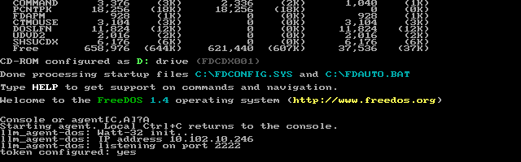

## Windows for Workgroups 3.11

Notepad text was entered through the corrected Win16 agent. The guest reports Windows API version 3.10; this installation is Windows for Workgroups 3.11.

## Windows 95

One of the two running Windows 95 guests; duplicate OS installations are represented once.

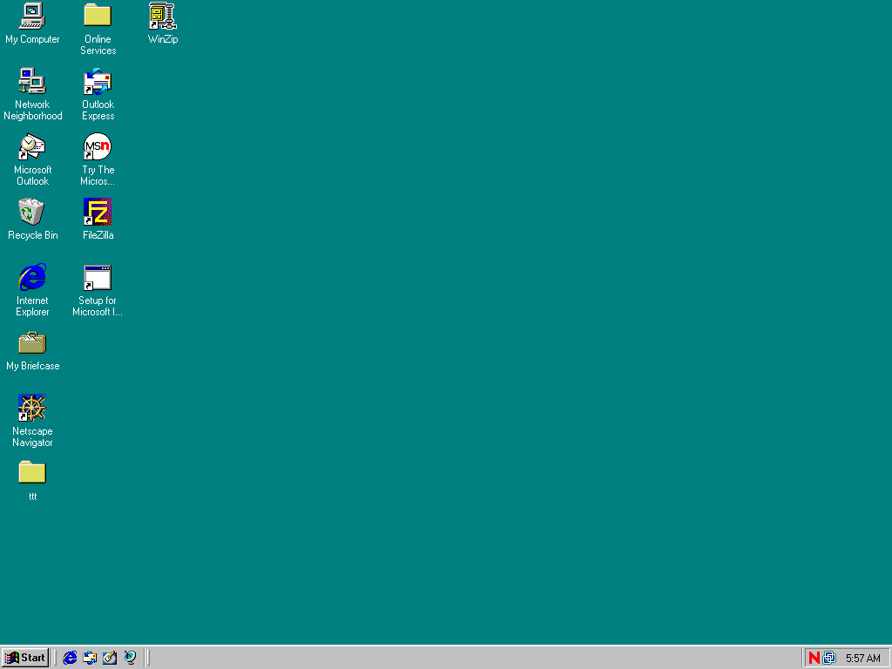

## Windows NT 4.0

Windows NT 4.0 SP6 with a legacy Selsius administration page open.

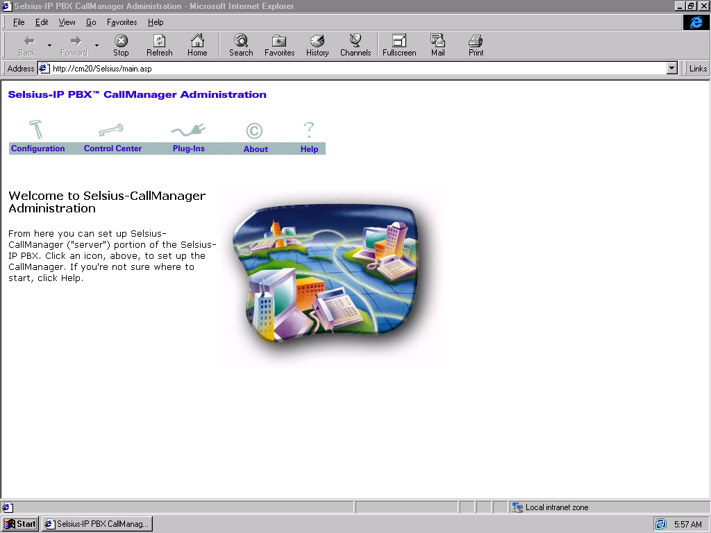

## Windows 2000 Server

The console was locked. Capturing it does not imply the agent can bypass Windows logon.

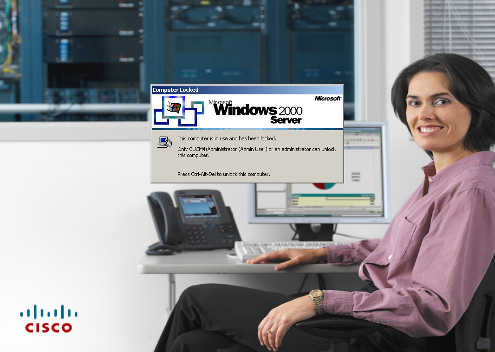

## Windows XP

Windows XP SP2 with a legacy softphone application open.

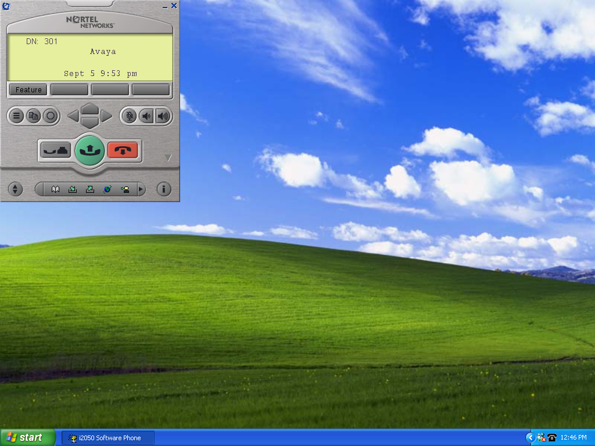

## Windows 7

Windows 7 SP1, with Notepad launched and text entered through the interactive agent.

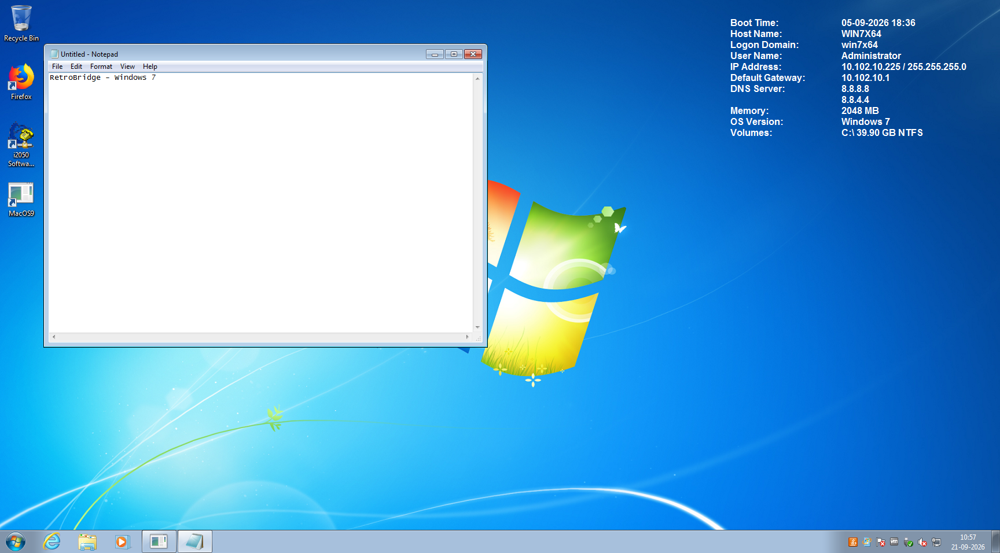

## OS/2 1.3

The 16-bit OS/2 agent captures Presentation Manager.

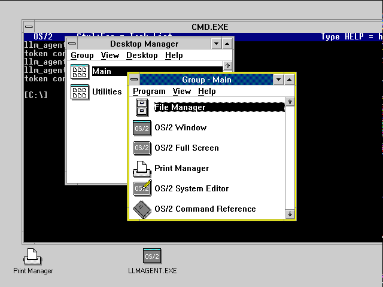

## OS/2 2.11

OS/2 2.11; the command interpreter identifies itself as version 2.1.

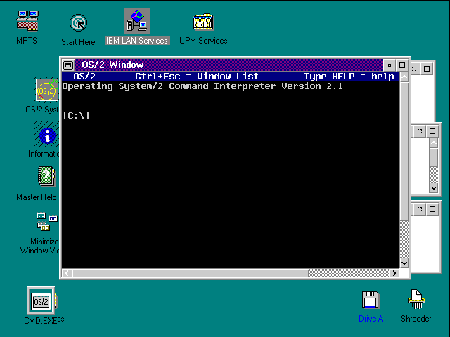

## OS/2 4.50

The guest reports kernel version 4.50, despite an older inventory nickname.

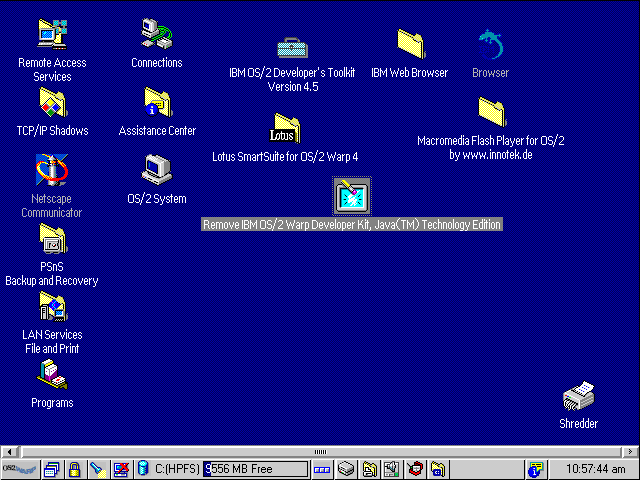

## Mac OS System 7.5.3

Finder on System 7.5.3, captured by the 68k MacTCP agent.

## NetWare 3.12

Live text-console cells rendered by the fixed NetWare 3.12 agent, including its verified update log.

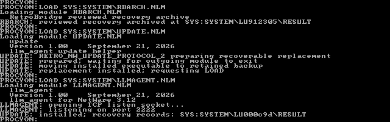

## NetWare 4.11

Live text-console cells rendered by the fixed NetWare 4.11 agent, including its verified update log.

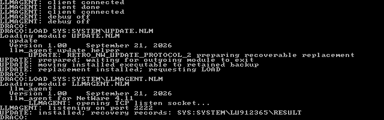
